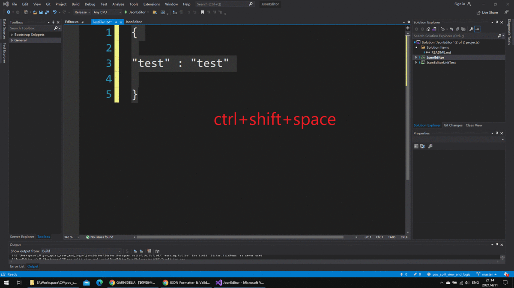
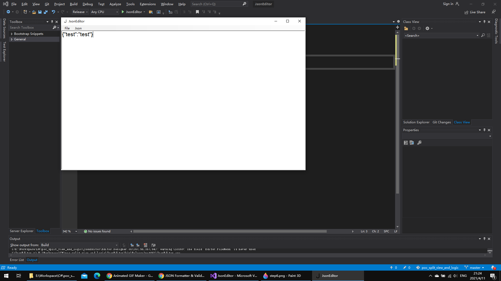
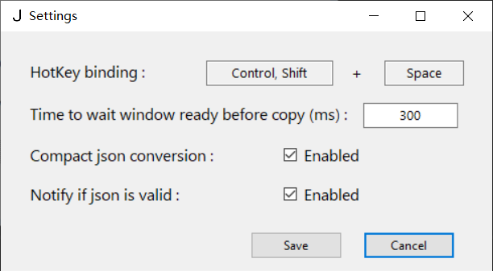

# JsonEditor

JsonEditor is a light weight windows application to validate json and convert it between compact format and indented format.

## Usage
- Default Hotkey: ctrl + shift + space

- Conversion in an application
  

- Editor
  

- Settings
  